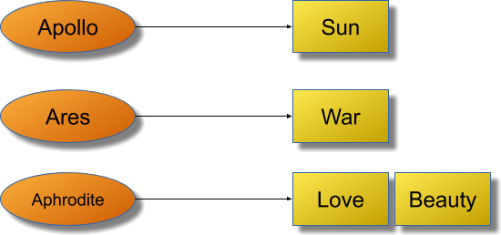
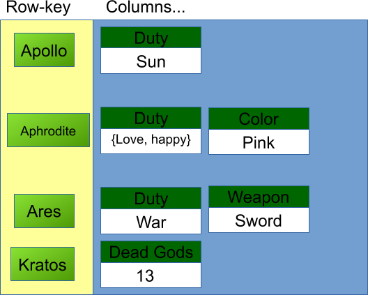
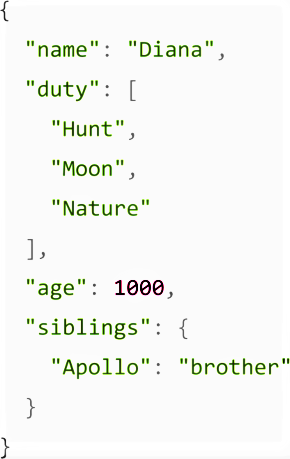
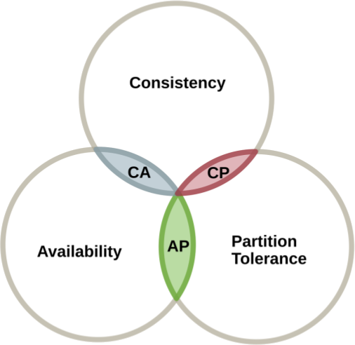

# NoSQL basics

NoSQL banks are a class of persistence technology that provides a new storage mechanism that meets standardization and relational databases. Like any other bank, it has the same objectives, that is, to insert, update, retrieve, and delete information, however, with new concepts of modeling and storage structure.

The term NoSQL was initially related to "not SQL" and was later extended to *Not Only SQL*, that is, "not just SQL", opening the concept of polyglot awareness (the work of dealing with different types of banks to reach the objectives in the application). The main characteristics of these banks are speed and a high rate of scalability, as well as the facility, to increase the number of database servers. This prevents the bottleneck of operations, avoids a point of failure, and distributes them geographically, making the data close to the users who will make the request. NoSQL banks are being adopted more frequently in several types of applications, including applications for financial institutions. As a consequence, the number of suppliers for this type of database is also growing.

Currently, NoSQL databases are classified into four groups (key value, column family, document, and graphs) defined by their storage model:

> To understand a new concept, it is very common to make a comparison with the existing knowledge. Thus, considering that relational databases are very famous, we will make a comparison between relational databases and NoSQL throughout this chapter.

## Key-value

Key-value banks have a structure similar to `java.util.Map`, that is, the information will be retrieved only by the key. This type of database can be used, for example, to manage the user's session. Another interesting case is the DNS, whose key is the address, for example, `www.google.com` and the value is the IP of that server.

Currently, there are several key-value database implementations, among which the most famous are:

* AmazonDynamo
* AmazonS3
* Redis
* Scalaris
* Voldemort

Comparing the relational database with the key-value type, it is possible to notice some points. The first is that the key-value structure is quite simple. It is not possible to perform operations such as `join` between the `buckets` and the value consists of a large block of information instead of being subdivided into columns as in the relational database.

| Relational structure | Key-value structure |
| -------------------- | ------------------- |
| Table                | Bucket              |
| Row                  | Key / value pair    |
| Column               | ----                |
| Relationship         | ----                |

### Column family/Wide-column

This model became popular through Google's *paper “BigTable”*, with the objective of building a distributed data storage system, designed to have a high degree of scalability and data volume. Like the key-value, to perform a search or retrieve some information within the database, it is necessary to use the field that functions as a unique identifier that would be similar to the key in the key-value structure. However, the similarities end there. The information is grouped in columns: a unit of information that is made up of the name and the information itself.

These types of databases are important when dealing with a high degree of data volume, so it is necessary to distribute the information among several servers. But it is worth noting that its reading operation is quite limited, similar to the key-value, since the search for information is defined from a single field or a key. Several databases use these structures, for example:

* Hbase
* Cassandra
* Scylla
* Clouddata
* SimpleDb
* DynamoDB

Among the types of databases of the column family type, Apache Cassandra is the most famous. Thus, if an application needs to deal with a large volume of data and with easy scalability, Cassandra is certainly a good option.

By comparing the column type family bank with the relational banks, it is possible to notice that the operations, in general, are much faster. It is simpler to work with large volumes of information and servers distributed around the world, however, this comes at a cost: the reading of this type of database is very limited. For example, it is not possible to make joins between a family of columns as in the relational bank. The column family allows you to have an unlimited number of columns, which in turn is composed of name and information, exactly as shown in the following table:

| Relational structure | Column family structure |
| -------------------- | ----------------------- |
| Table                | Column Family           |
| Row                  | Column                  |
| Column               | Column name and value   |
| Relationship         | Not supported           |

## Document oriented

Document-oriented databases have a structure very similar to a `JSON` or `XML` file. They are composed of a large number of fields, which are created at run time, generating great flexibility, both for reading and writing information.

They allow information to be read by fields that are not the key. Some implementations, for example, have a very high integration with search engines. Thus, this type of database is crucial when performing data analysis or system logs. There are some implementations of document type databases, the most famous of which is MongoDB.

* AmazonSimpleDb
* ApacheCouchdb
* MongoDb
* Riak

When comparing with a relational base, although it is possible to perform a search for fields other than the unique identifier, document-type banks do not have relationship support. Another point is that document banks, in general, are *schemeless*.

| Relational structure | Document structure |
| -------------------- | ------------------ |
| Table                | Collection         |
| Row                  | Document           |
| Column               | Key / value pair   |
| Relationship         | -                  |

## Graphs

Graph-type banks are a data structure that connects a set of vertices through a set of edges. Modern banks in this category support multi-relational graph structures, where there are different types of vertices (representing people, places, items) and different types of edges. The recommendation systems that take place on social networks are the biggest case for the graph type bank. Of the most famous database types in the NoSQL world, the graph has a distinct structure from the relational one.

* Neo4j
* InfoGrid
* Sones
* HyperGraphDB

## CAP theorem

One of the great challenges of NoSQL databases is that they deal with distributed persistence, that is, the information is located on more than one server. Several studies were created to help in this challenge of distributed persistence. The most famous was a theory created in 1999, the CAP Theorem.

This theorem states that distributed data storage can’t provide more than two of the following three guarantees simultaneously:

* Consistency: an assurance that each node in a distributed cluster returns the same most recent and successful write. Consistency refers to each customer with the same view of the data.
* Availability: each request receives a response (no error) - no guarantee that it contains the most recent writing
* Partition tolerance: the system continues to function and maintain its consistency guarantees despite network partitions. Distributed systems that guarantee tolerance continue to operate even if there is a failure in one of the nodes since there is at least one node to operate the same job and guarantee the perfect functioning of the system.

In general, this theorem explains that there is no perfect world. When you choose one characteristic, you lose yourself in another as a consequence. In an ideal world, a distributed database would be able to support all three characteristics, but in reality, the developer needs to know what he will lose when choosing between one or the other.

For example, Apache Cassandra is AP, that is, its architecture will focus on fault tolerance and availability. There will be inconsistency, so in a few moments, a node will return outdated information.

However, Cassandra has the consistency level feature, so that it is possible to make certain requests to the database be sent to all nodes at the same time, ensuring consistency. It is worth mentioning that in doing so he will lose the `A`, of availability of the CAP theorem.

### Conclusion

This chapter aimed to kick-start non-relational databases. Concepts were discussed, the types of banks that exist so far, and their structures. With this new persistence paradigm, new possibilities and challenges for applications emerge.

This type of database has come to face the new era of applications, in which speed or the shortest possible response time is a great advantage. With this introductory chapter, you can continue exploring non-relational banks, with Cassandra.