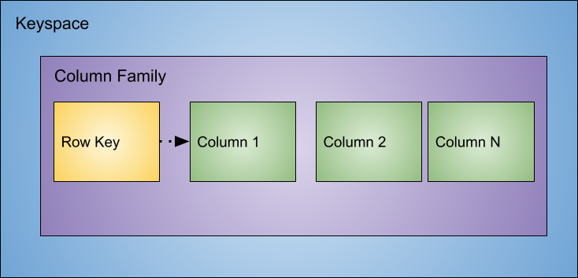
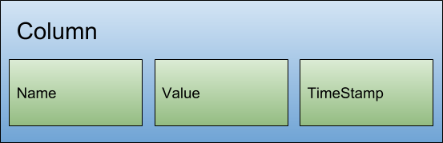
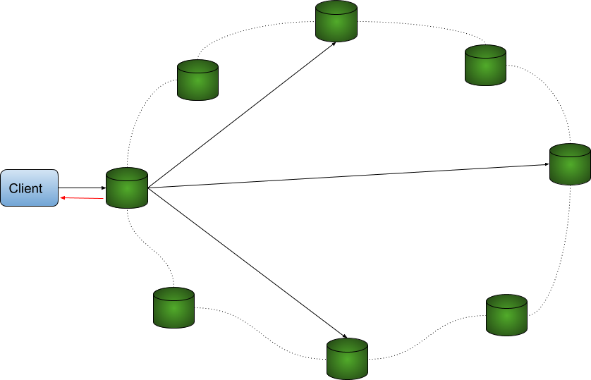

# Cassandra

Cassandra is a NoSQL database oriented to the column family that was born to solve problems with applications that need to operate with gigantic data loads, besides being able to scale with great ease. It was born on Facebook and today has been used intensively by companies of the most varied sizes, such as Netflix, Twitter, Instagram, HP, IBM, among many others.

An important factor worth mentioning is its increasing adoption even in more conservative markets; financial institutions and government agencies, such as NASA. This chapter’s main objective is to talk about Cassandra's body, its characteristics, and its concepts.

## Definition

Focusing a little more on the technical aspects of Cassandra, it is possible to highlight some points:

* **Fault-tolerant**: the data is replicated to several nodes, so that if one node falls another one will be ready to replace it without *downtime*. This feature is thanks to its *masterless* feature, which allows all nodes to have the same behavior, that is, at the same time that it writes it also reads information from the database. Each node exchanges information directly between them. This happens in continuous cycles, and each operation is done from a handshake, *handshake*, in pairs. So, if a cluster has four nodes (for example, imagine that the machine names are A, B, C, and D), in the first cycle node A shares information with B and C with D, in the second cycle A with C, and D with B, and so on. It is from this handshake that the node will discover the locations of others, in addition to the information in the database itself. This communication protocol that Cassandra uses is Gossip.

* **Decentralized**: avoiding an Achilles heel in an application is always a challenge, which becomes much greater when it comes to a distributed database. Data can be lost, the internet can be interrupted or even a database server can be physically destroyed, among other problems that can happen - which is why avoiding a point of failure is important in applications. For Cassandra, this feature comes natively without making any major changes.

* **Elastic**: several machines can grow or decrease linearly without any interruption in the application. Thus, on days with a high degree of processing, for example, the week of Black Friday, new servers can be added and, with the end of this peak period, the information can return to the number of original nodes.

## Hierarchy

Since Cassandra is a NoSQL database of the column family type, it will follow the same hierarchy explained previously for this type of non-relational database. Above the column family, there is an item, which is *keyspace*, so that Cassandra's hierarchy will look like this:

* Keyspace
* Column Family
* Column

### Keyspace

The keyspace is the structure that stores or contains one or more families of columns. If we think analogously to a relational persistence data technology, it would be similar to a database whose structure stores the tables. Another equally important responsibility that the keyspace has is the definition of the replica factor. It defines the number of times the same information will be copied (replicated) between the servers.

For example, given a cluster with five servers, and a keyspace with a replication factor of four, it is possible to state that in this cluster the same information will be copied four times, that is, in practically all nodes within the data center. With the creation of the replica factor comes the methodology, the definition of how this information will be copied between the nodes, is called *replication strategy*.

* **Simple Strategy**: this is the replication strategy indicated in case it is necessary to use only a single datacenter with all nodes.

* **Network Topology Strategy**: This strategy is highly recommended for production environments and is used when it is necessary to use more than one data center. This is recommended for several reasons, for example, imagine a natural disaster in the region where one of the data centers are located, in São Paulo. This will not be a problem if the developer has two other datacenters up his sleeve, around Brazil, as in Salvador and another one in Rio de Janeiro. This is something very similar that Netflix does with its data with datacenters around the world.

### Column Family and Column

The column family is a container of rows, with each row consisting of one or more columns. Each column is composed of name, value, and timestamp, which will be used to check which information is the most up-to-date.

The parts of the column are:

* **Name**: which represents the name of the column;
* **Value**: the information itself that is inside the column;
* **Timestamp**: as soon as a column is created or changed, this value is updated with the date of the change. It serves to inform which column is the most recent. For example, during the communication between two nodes to share information, using the gossip protocol that we reported above, it will be this timestamp that will inform which column is the hottest, thus, it will be kept in both databases.

## Performing an operation inside Cassandra

In Cassandra, each node has the responsibility for both writing and reading. When a request is made to the database, the following steps are performed:

1. The first is the definition of the node that will be responsible for managing the database client order. This node is known as the coordinator.

2. The coordinating node will be responsible for operating the query between the other clusters, for example, when searching for information from its respective unique identifier, the ID, that node will generate numerical value from the ID.

3. This numerical value will function as a router since each node is responsible for a range of numerical values, thus, the coordinating node will send the request to the node responsible for that number.

   Something important to note is that this range of values for which each node is responsible is automatically managed according to the number of cassandra nodes available.

The partitioner has a responsibility to define how data will be distributed around nodes within a data center. In general, it will generate a numeric value from the ID. This configuration is performed globally, that is, all clusters must use the same type of partitioner.

. From that key, the partitioner will be responsible for generating a numeric value and, afterwards, saying which node is responsible for that information. In our example, the information with the key `Jim` generated the numeric value one and will go to the server * A *.")

## Consistency versus availability

For each request, it is possible to configure the level of consistency with which an operation will be performed. This level defines how many nodes need to respond to the coordinator to indicate that the process, whether written or read, has been carried out successfully. This configuration is a key point between the consistency and availability dilemma:

It is important to note that the greater the number of nodes used for an operation, it is possible to guarantee a high degree of consistency.

## Inside a Cassandra node

Once we discuss how Cassandra works in a cluster, we also need to talk about how it works internally and its parts. As soon as Cassandra receives a write operation, it stores the information in memory in a structure called memtable and also uses a structure on the disk, called commit log. This commit log receives each write made by Cassandra and it remains even when the node is turned off. Thus, when writing begins, the sequence within a Cassandra node is:

* Performs `logging` within the commit log
* Writes the same information to memory, `memtable`
* Performs the `flush` operation from the` memtable`
* Store information in an orderly way inside the disk with `SSTables`

It is also important to note that both `memtables` and `SSTable` are stored by table, in an organized way and optimized for reading and writing, and `SSTable` has its information inside the disk.

### Writing operations

The following table shows the level of writing consistency from the strongest to the weakest, with stronger writing means greater consistency, that is, writing to more nodes within the data centers implies availability. It is worth noting that the write operation on each node means writing both in the `commit log` and `memtable`.

| Consistency level | Description                                                  |
| ----------------- | ------------------------------------------------------------ |
| `ALL`             | The write operation on all replica nodes within the cluster  |
| `EACH_QUORUM`     | The quorum write operation for replicas in each datacenter   |
| `QUORUM`          | Similar to the previous one, written in quorum through all datacenters |
| `LOCAL_QUORUM`    | The quorum write operation within the coordinator node's datacenter |
| `ONE`             | The write operation must take place on at least one node     |
| `TWO`             | Defines the write operation on at least two nodes            |
| `THREE`           | Defines the write operation on at least three nodes          |
| `LOCAL_ONE`       | You must perform the write operation on at least one node within the data center |
| `ANY`             | Ensures the write operation on at least one node.            |

> QUORUM is the value more than half, that is, the formula is (replication factor / 2) + 1

### Read operations

The following table shows the reading information from the strongest to the weakest, taking consistency into account. An important point is that in each read operation there is the concept of *read repair*. The read repair improves the data consistency based on the simple strategy that, after a request, the coordinator will take the most updated information and share it among all the nodes that participated in the reading operation.

In this operation, in general, the coordinating node performs a *request* and from the consistency level, it defines the number of nodes that will participate in the operation. After that, the "hottest" information is sent to the customer, then the *read repair* operation is performed asynchronously.

| Level          | Description                                                  |
| -------------- | ------------------------------------------------------------ |
| `ALL`          | Returns the answer after all replicas have been answered     |
| `QUORUM`       | Returns the response after all data center quorum has responded |
| `LOCAL_QUORUM` | Returns the response after the coordinator node's datacenter quorum |
| `ONE`          | Returns the response after reading from the nearest node     |
| `TWO`          | Returns the answer after reading from the two nearest nodes  |
| `THREE`        | Returns the answer after reading from the three nearest nodes |
| `LOCAL_ONE`    | Returns the response after reading from the nearest node within the coordinating node's data center |
| `SERIAL`       | Allows reading the current (and possibly not compromised) state of the data without proposing a new addition or update. If a `SERIAL` reading finds an unconfirmed transaction in progress, the transaction will be confirmed as part of the reading. Similar to `QUORUM` |
| `LOCAL_SERIAL` | Similar to` SERIAL`, but confined to a data center similar to `LOCAL_QUORUM`. |

### Conclusion

Apache Cassandra is a bank with very intriguing architecture and shows the full harmony of its functioning from a single node to its operation in conjunction with tens of thousands of nodes within different datacenters around the world. Its way of distributing the data in writing among the clusters from the key makes it focus on availability and fault tolerance. If we thought about the CAP theorem, Cassandra would have a focus on the AP. In the next chapter, we'll get out of the theory a little and learn how to install Cassandra in various ways.