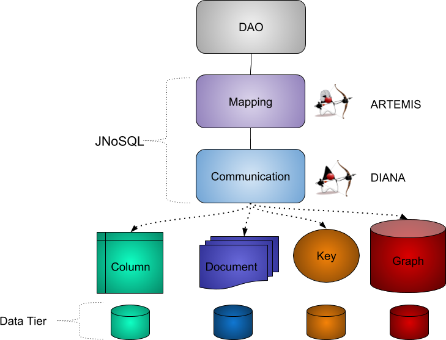

# Criando um aplicativo com Java EE, ops, Jakarta EE

Um dos grandes diferenciais dentro do mundo Java são as especificações. Essas especificações são regidas pelo órgão JCP, cujo foco é garantir uma comunicação transparente, uma forte participação entre os grupos de usuários Java ao redor do mundo. 

Além da comunidade, existem diversos benefícios técnicos, por exemplo, a possibilidade de se desfrutar do _multi-vendors_ evitando ficar preso a um único fornecedor (o conceito de _vendor lock-in_), compromisso com a retrocompatibilidade, uma rica documentação realizada por diversas empresas, dentre outros. 

O objetivo deste capítulo é falar um pouco sobre um dos frutos desse órgão: o Java EE e sua solução para o mundo não relacional.

## O que é Jakarta EE?

Uma das grandes mudanças no mundo Java EE é que, em 2017, ele foi doado para a Eclipse Foundation pela Oracle, então ali se iniciou o processo de transição. Assim, a Oracle não é mais responsável pela especificação Java EE, todo esse trabalho será mantido pela Foundation. Um ponto importante a salientar é o que foi transferido:


* Código que pertence às APIs;
* As documentações;
* As implementações de referências que pertenciam à Oracle (vale lembrar de que existem especificações que não são gerenciadas pela Oracle, como é o caso do Bean Validation e o CDI).

Porém, não foi entregue o direito do nome Java, dessa forma, não era possível continuar se chamando “Java EE”. Com isso, foi realizado uma votação por dentro da comunidade e eles elegeram o novo nome: Jakarta EE, além do novo logo.
Assim, de uma maneira geral o Jakarta EE é apenas a nova casa do Java EE.

Como premissa, sob nova direção com Eclipse Foundation, o Jakarta EE manterá compatibilidade com a última versão do Java EE, a versão 8, além de trazer novidades para dentro da plataforma. 

Um dos pontos importantes é que para trazer mais novidades para a plataforma está sendo criado um novo ciclo para especificação no lugar das famosas JSRs, com foco principal de facilitar o desenvolvimento, realizar entregas rápidas e receber feedbacks de maneira mais rápida da comunidade. 

Como primeira especificação, nasceu o Eclipse JNoSQL, cujo foco é realizar integração entre os bancos NoSQL e Java.

```

```

## Utilizando Jakarta NoSQL, a primeira especificação do Jakarta EE

O Jakarta NoSQL é um framework que realiza a integração entre as aplicações Java com bancos de dados NoSQL. 

Ele define um grupo de APIs cujo objetivo é padronizar a comunicação entre a maioria dos bancos de dados e suas operações comuns. Isso ajuda a diminuir o acoplamento com este tipo de tecnologia utilizada nas aplicações atuais.

O projeto tem duas camadas:

1. Camada de comunicação: é um grupo de APIs que define a comunicação com os bancos de dados não relacionais. Comparado aos tradicionais bancos não relacionais, eles são semelhantes às APIs JDBC. Ela contém quatro módulos, um para cada tipo de banco NoSQL: chave-valor, família de coluna, documento e grafos.

2. Camada de mapeamento: API que ajuda o desenvolvedor na integração com o banco não relacional, sendo orientada a anotações e utilizando tecnologias como injeção de dependências e Bean Validation, o que torna simples para os desenvolvedores a utilizarem. Comparando com os clássicos RDBMS, essa camada pode ser comparada com o JPA ou outros frameworks de mapeamentos como o Hibernate.



Assim como no Spring Data, o Jakarta NoSQL trabalha em conjunto com um motor de injeção de dependência, porém, no projeto se utiliza a especificação do CDI. Utilizando o mesmo princípio, começaremos com os códigos e arquivos de configuração que são necessários para fazer o contêiner do CDI levantar, além de fazer da comunicação com o Cassandra. 

> O CDI é um framework de injeção de dependência muito interessante e com diversos recursos, como definição de escopo, disparo de evento de maneira síncrona e assíncrona além de ser o padrão do mundo Java. Para conhecer mais uma excelente leitura é o livro de CDI da Casa do Código: https://www.casadocodigo.com.br/products/livro-cdi

O arquivo de configuração é o `bean.xml`, que fica localizado dentro do `META-INF` (a mesma localização do `persistence.xml` do JPA). Também existirá o `CassandraProducer`, que terá como responsabilidade criar a conexão com o Cassandra.

```xml
<beans xmlns="http://xmlns.jcp.org/xml/ns/javaee"
       xmlns:xsi="http://www.w3.org/2001/XMLSchema-instance"
       xsi:schemaLocation="http://xmlns.jcp.org/xml/ns/javaee
		http://xmlns.jcp.org/xml/ns/javaee/beans_1_1.xsd"
       bean-discovery-mode="all">
</beans>
```

A classe de configuração “ensina” ao CDI como gerar a dependência de `CassandraColumnFamilyManager`, que é a classe responsável por realizar a comunicação entre o Java e o banco de dados. A classe `Settings` representa as informações para conexão com o banco de dados. Nela, é possível, por exemplo, definir a senha, usuário, clusters, dentre outras informações.

```java
@ApplicationScoped
public class CassandraProducer {

    private static final String KEYSPACE = "library";

    private CassandraConfiguration cassandraConfiguration;

    private CassandraColumnFamilyManagerFactory managerFactory;

    @PostConstruct
    public void init() {
        cassandraConfiguration = new CassandraConfiguration();
        Settings settings = Settings.of(Collections.singletonMap("cassandra-host-1", "localhost"));
        managerFactory = cassandraConfiguration.get(settings);
    }


    @Produces
    @ApplicationScoped
    public CassandraColumnFamilyManager getManagerCassandra() {
        return managerFactory.get(KEYSPACE);
    }

    public void dispose(@Disposes CassandraColumnFamilyManager manager) {
        manager.close();
        managerFactory.close();
    }

}
```

O próximo passo se encontra em realizar a modelagem da entidade de livros. Caso você venha do mundo JPA verá que os conceitos são os mesmos, ou seja, usamos a anotação `Entity` para mapear uma entidade, a anotação `Id` para identificar o atributo que será o identificador único, além da anotação `Column` para identificar os outros campos que serão persistidos.


```java
@Entity("book")
public class Book {

    @Id("isbn")
    private Long isbn;

    @Column
    private String name;

    @Column
    private String author;

    @Column
    private Set<String> categories;

    //getter and setter
```


O Jakarta NoSQL tem como sua maior característica a integração com um framework de injeção de dependência, assim como o Spring Data, porém, a diferença é que a especificação utiliza o CDI, que é a especificação do mundo Java. 

Uma outra semelhança entre as ferramentas de integração se dá pelo fato de que o primeiro passo é levantar o contêiner. O projeto possui uma classe template para operações dentro do Mapper: o `ColumnTemplate`, porém, ele funciona como esqueleto de operações de um Mapper para todos os bancos do tipo família de coluna, ou seja, seria possível trocar para o Hbase com pouco ou nenhum impacto no código.


```java
public class App
{
    public static void main( String[] args )
    {
        try(SeContainer container = SeContainerInitializer.newInstance().initialize()) {
            ColumnTemplate template =  container.select(ColumnTemplate.class).get();

            Book cleanCode = getBook(1L, "Clean Code", "Robert Cecil Martin", Sets.newHashSet("Java", "OO"));
            Book cleanArchitecture = getBook(2L, "Clean Architecture", "Robert Cecil Martin", Sets.newHashSet("Good practice"));
            Book effectiveJava = getBook(3L, "Effective Java", "Joshua Bloch", Sets.newHashSet("Java", "Good practice"));
            Book nosql = getBook(4L, "Nosql Distilled", "Martin Fowler", Sets.newHashSet("NoSQL", "Good practice"));

            template.insert(cleanCode);
            template.insert(cleanArchitecture);
            template.insert(effectiveJava);
            template.insert(nosql);

            ColumnQuery query = select().from("book").build();
            Stream<Book> books = template.select(query);
            books.forEach(System.out::println);
        }
    }

    private static Book getBook(long isbn, String name, String author, Set<String> categories) {
        Book book = new Book();
        book.setIsbn(isbn);
        book.setName(name);
        book.setAuthor(author);
        book.setCategories(categories);
        return book;
    }
}
```

A API do Jakarta NoSQL possui recursos interessantes como a query e a API fluente. Vale salientar que esses recursos são portáveis para outros bancos de dados não relacionais do tipo família de coluna como o Apache Hbase. No código a seguir, mostraremos consultas utilizando a API do Jakarta NoSQL utilizando tanto o recurso de API fluente como utilizando uma query como texto. Um ponto importante é o uso do `Optional` quando se faz busca com apenas um único elemento, ou seja, a API já nasceu acima do Java 8.


```java
public class App2 {


    public static void main(String[] args) {

        try(SeContainer container = SeContainerInitializer.newInstance().initialize()) {
            ColumnTemplate template =  container.select(ColumnTemplate.class).get();

            Book cleanCode = getBook(1L, "Clean Code", "Robert Cecil Martin", Sets.newHashSet("Java", "OO"));
            Book cleanArchitecture = getBook(2L, "Clean Architecture", "Robert Cecil Martin", Sets.newHashSet("Good practice"));
            Book effectiveJava = getBook(3L, "Effective Java", "Joshua Bloch", Sets.newHashSet("Java", "Good practice"));
            Book nosql = getBook(4L, "Nosql Distilled", "Martin Fowler", Sets.newHashSet("NoSQL", "Good practice"));

            template.insert(cleanCode);
            template.insert(cleanArchitecture);
            template.insert(effectiveJava);
            template.insert(nosql);


            Optional<Book> book = template.find(Book.class, 1L);
            System.out.println("Book found: " + book);

            template.delete(Book.class, 1L);

            System.out.println("Book found: " + template.find(Book.class, 1L));


            PreparedStatement prepare = template.prepare("select * from Book where isbn = @isbn");
            prepare.bind("isbn",2L);
            Optional<Book> result = prepare.getSingleResult();
            System.out.println("prepare: " + result);
        }

    }

    private static Book getBook(long isbn, String name, String author, Set<String> categories) {
        Book book = new Book();
        book.setIsbn(isbn);
        book.setName(name);
        book.setAuthor(author);
        book.setCategories(categories);
        return book;
    }

}
```


No mapeamento da categoria, a sequência continua semelhante, com diferença do mapeamento do `UDT`. Dentro do Jakarta NoSQL, existe o recurso de extensões que permite APIs de usos específicos para cada banco de dados. Por exemplo, utilizaremos uma extensão do Cassandra que permite que utilizemos a anotação `UDT` para mapear nosso código para o tipo UDT, como mostra o mapeamento a seguir.

```java
@Entity("category")
public class Category {

    @Id("name")
    private String name;

    @Column
    @UDT("book")
    private Set<BookType> books;
    //getter and setter
}


public class BookType {

    @Column
    private Long isbn;

    @Column
    private String name;

    @Column
    private String author;

    @Column
    private Set<String> categories;
    //getter and setter
}
```


Uma vez utilizando anotações específicas do Cassandra, será utilizado o `CassandraTemplate`, que é uma especialização do `ColumnTemplate` com recursos específicos para o Cassandra como, por exemplo, a possibilidade de definir o nível de consistência durante a requisição e realizar queries nativas, ou seja, CQL.


```java
public class App4 {


    public static void main(String[] args) {
        try(SeContainer container = SeContainerInitializer.newInstance().initialize()) {
            CassandraTemplate template =  container.select(CassandraTemplate.class).get();

            BookType cleanCode = getBook(1L, "Clean Code", "Robert Cecil Martin", Sets.newHashSet("Java", "OO"));
            BookType cleanArchitecture = getBook(2L, "Clean Architecture", "Robert Cecil Martin", Sets.newHashSet("Good practice"));
            BookType effectiveJava = getBook(3L, "Effective Java", "Joshua Bloch", Sets.newHashSet("Java", "Good practice"));
            BookType nosqlDistilled = getBook(4L, "Nosql Distilled", "Martin Fowler", Sets.newHashSet("NoSQL", "Good practice"));


            Category java = getCategory("Java", Sets.newHashSet(cleanCode, effectiveJava));
            Category oo = getCategory("OO", Sets.newHashSet(cleanCode, effectiveJava, cleanArchitecture));
            Category goodPractice = getCategory("Good practice", Sets.newHashSet(cleanCode, effectiveJava, cleanArchitecture, nosqlDistilled));
            Category nosql = getCategory("NoSQL", Sets.newHashSet(nosqlDistilled));

            template.insert(java);
            template.insert(oo);
            template.insert(goodPractice);
            template.insert(nosql);

            Optional<Category> category = template.find(Category.class, "Java");
            System.out.println(category);
            template.delete(Category.class, "Java");

            PreparedStatement prepare = template.prepare("select * from Category where name = @name");
            prepare.bind("name","NoSQL");
            Optional<Book> result = prepare.getSingleResult();
            System.out.println("prepare: " + result);
        }

    }

    private static Category getCategory(String name, Set<BookType> books) {
        Category category = new Category();
        category.setName(name);
        category.setBooks(books);
        return category;
    }

    private static BookType getBook(long isbn, String name, String author, Set<String> categories) {
        BookType book = new BookType();
        book.setIsbn(isbn);
        book.setName(name);
        book.setAuthor(author);
        book.setCategories(categories);
        return book;
    }

}
```

Além das classes templates, o Jakarta NoSQL oferece suporte ao conceito de interfaces repositórios que segue o mesmo princípio do Spring Data: interfaces que visam ter um algo grau de abstração para realizar consultas dentro do banco. Ele também traz uma interface que já possui diversos métodos e `method by query` que serão implementados de maneira automática pelo framework. Nesse caso, será utilizado o `CassandraRepository`, que é uma especialização do `Repository` que permite, por exemplo, o uso da anotação `CQL` que, basicamente, executa Cassandra Query Language e converte para a entidade automaticamente.


```java
public interface BookRepository extends CassandraRepository<Book, Long> {

    Stream<Book> findAll();

    @CQL("select * from book")
    Stream<Book> findAll1();

    @Query("select * from Book")
    Stream<Book> findAll2();
}

```

> A diferença entre as anotações `CQL` e `Query` é que a primeira executa o CQL, que é a query nativa do Cassandra, assim, exclusiva do framework, e a segunda é a API do Jakarta NoSQL, ou seja, poderá ser executada por outros bancos de dados que suporte a camada de comunicação do projeto de especificação do mundo Jakarta EE.

No código a seguir faremos a nossa integração com o `BookRepository`. O que mais impressiona, certamente, é a facilidade em utilizá-lo uma vez que não precisamos nos preocupar com a implementação da interface. Um ponto importante é que essa interface herda de `CassandraRepository`, o que faz com que esse repositório herde vários métodos como o `save`, `findById`, dentre outros. 

```java
public class App5
{
    public static void main( String[] args )
    {
        try(SeContainer container = SeContainerInitializer.newInstance().initialize()) {
            BookRepository repository =  container.select(BookRepository.class).get();

            Book cleanCode = getBook(1L, "Clean Code", "Robert Cecil Martin", Sets.newHashSet("Java", "OO"));
            Book cleanArchitecture = getBook(2L, "Clean Architecture", "Robert Cecil Martin", Sets.newHashSet("Good practice"));
            Book effectiveJava = getBook(3L, "Effective Java", "Joshua Bloch", Sets.newHashSet("Java", "Good practice"));
            Book nosql = getBook(4L, "Nosql Distilled", "Martin Fowler", Sets.newHashSet("NoSQL", "Good practice"));

            repository.save(cleanCode);
            repository.save(cleanArchitecture);
            repository.save(effectiveJava);
            repository.save(nosql);

            Optional<Book> book = repository.findById(1L);
            System.out.println(book);

            repository.deleteById(1L);

            System.out.println("Using method query");
            repository.findAll().forEach(System.out::println);
            System.out.println("Using CQL");
            repository.findAll1().forEach(System.out::println);
            System.out.println("Using query JNoSQL");
            repository.findAll2().forEach(System.out::println);

        }
    }

    private static Book getBook(long isbn, String name, String author, Set<String> categories) {
        Book book = new Book();
        book.setIsbn(isbn);
        book.setName(name);
        book.setAuthor(author);
        book.setCategories(categories);
        return book;
    }
}

```

> O projeto ainda tem diversos recursos que não foram exibidos aqui, por exemplo, a realizar operações de maneira assíncrona. Para saber mais acesse: http://www.jnosql.org/

> O código com todo exemplo se encontra em: https://github.com/otaviojava/cassandra-java-code para criar as estruturas do Cassandra, consulte o capítulo “Realizando integração com Java”.


### Conclusão

Com uma nova casa e de forma ainda mais vibrante, nasce o projeto Eclipse JNoSQL sob nova direção do Jakarta EE com a Eclipse Foundation. O Jakarta NoSQL tem como propósito facilitar a integração entre Java e NoSQL com a estratégia de dividir a camada de comunicação e mapeamento. Atualmente, ele suporta mais de trinta bancos de dados. Muitas melhorias são esperadas, porém, o grande benefício da plataforma é que ela é totalmente orientada à comunidade. Você mesmo pode sair da cadeira e ajudar o Jakarta EE agora mesmo.
