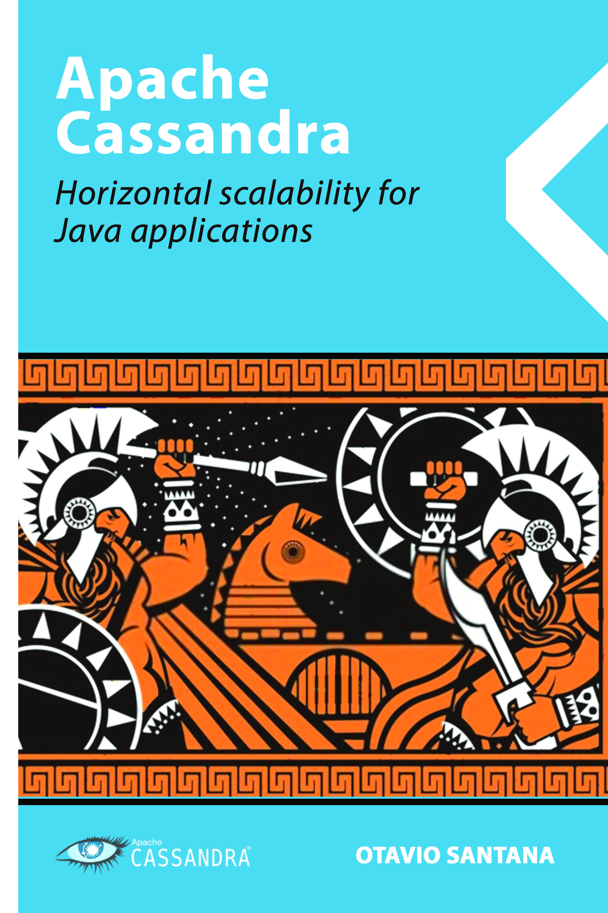

# Apache Cassandra Horizontal scalability for Java applications

In the competitive world of technology, millisecond improvements in performance can make all the difference for your customers. From this need, several paradigms and frameworks emerged, demanding, at the same time, a good and fast performance in the persistence of information. Apache Cassandra was born in this scenario, the NoSQL database, elastic, fault-tolerant, and with a high degree of performance. Cassandra is a non-relational database originated by Facebook. Today, it is an open-source project within the Apache Foundation with successes in the world's largest companies, such as Netflix, GitHub, eBay, among others.

In this book, Otávio Santana discusses Cassandra, its concepts, and its applicability with Java. After introducing non-relational databases, you will see concepts such as hierarchy, reading, writing, how they work on the node, and their orchestration within a Cluster. The practical operation of the communication language Cassandra Query Language or CQL will be presented, with modeling tips and mapping frameworks. DataStax Mapper, Spring Data Cassandra, Hibernate OGM Cassandra, and Eclipse JNoSQL.
